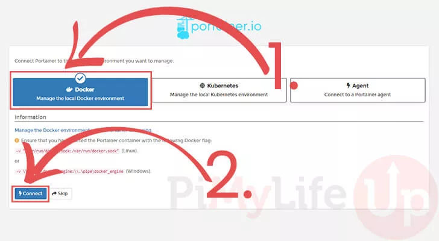

# docker-install
This repo contains install and update scripts for docker and for docker compose + portainer.

# Installation
One script to rule(read: install) them all!

__OR__

Manually install docker and/or docker compose + portainer

## Download repo
```bash
sudo apt install -y git
cd ~/
git clone https://github.com/4086449/docker-install.git
cd docker-install/
```

## Create .env file
Create a new file called .env
Paste the following lines and edit if needed. (i.e. you have to create a new Personal Access Token if you want use the "updateContainers.sh" script)
> [How-to create portainer access token](https://docs.portainer.io/api/access)

### Example .env
```bash
DOCKER_IMAGE="portainer/portainer-ce:latest"
PORTAINER_FOLDER="/home/pi/portainer"
PORTAINER_USER="admin"
PORTAINER_PASS="Youwillneverguessthispass!"
PORTAINER_PAT="123aNewPATForMe_456EatABagOfD!x="
```

## Install with All-in-One script
__docker + docker compose + portainer__
```bash
./install.sh
```

## Install manually
### Install Docker
> When asked, press 'y' 

_ignore warnings during install. All will be well after a reboot. This happens automatically at the end of the installDocker.sh script_

```bash
./installDocker.sh
```

### Install docker-compose & portainer
When asked, press 'y' 

_ignore warnings during install. All will be well after a reboot. This happens automatically at the end of the installDocker.sh script_

```bash
./installPortainer.sh
```

## Post-installation
You can now deploy containers with docker, docker-compose or portainer.
Portainer is available @ 'http://<ip_address_pi>:9000/'

Create Admin user 
Choose local environment like 



Once done, you're in the home screen. 
Press local to enter the environment and start deploying containers.
                                                    


## Static IP
### [DEPRECATED]
___since debian version bookworm___

---

### How To set static IP

Just a reminder to set a static ip

_edit file_
```bash
sudo nano /etc/dhcpcd.conf
```
Choose an ip address like '192.168.168.20'

Replace ip after 'static ip_address=' and copy/paste the whole section at the end of the dhcpcd.conf file

if you are __NOT__ using wifi, change 'wlan0' to 'eth0'

```bash
interface wlan0
static ip_address=192.168.168.20/24
static routers=192.168.168.1
static domain_name_servers=192.168.168.1 1.1.1.1 1.0.0.1
```
